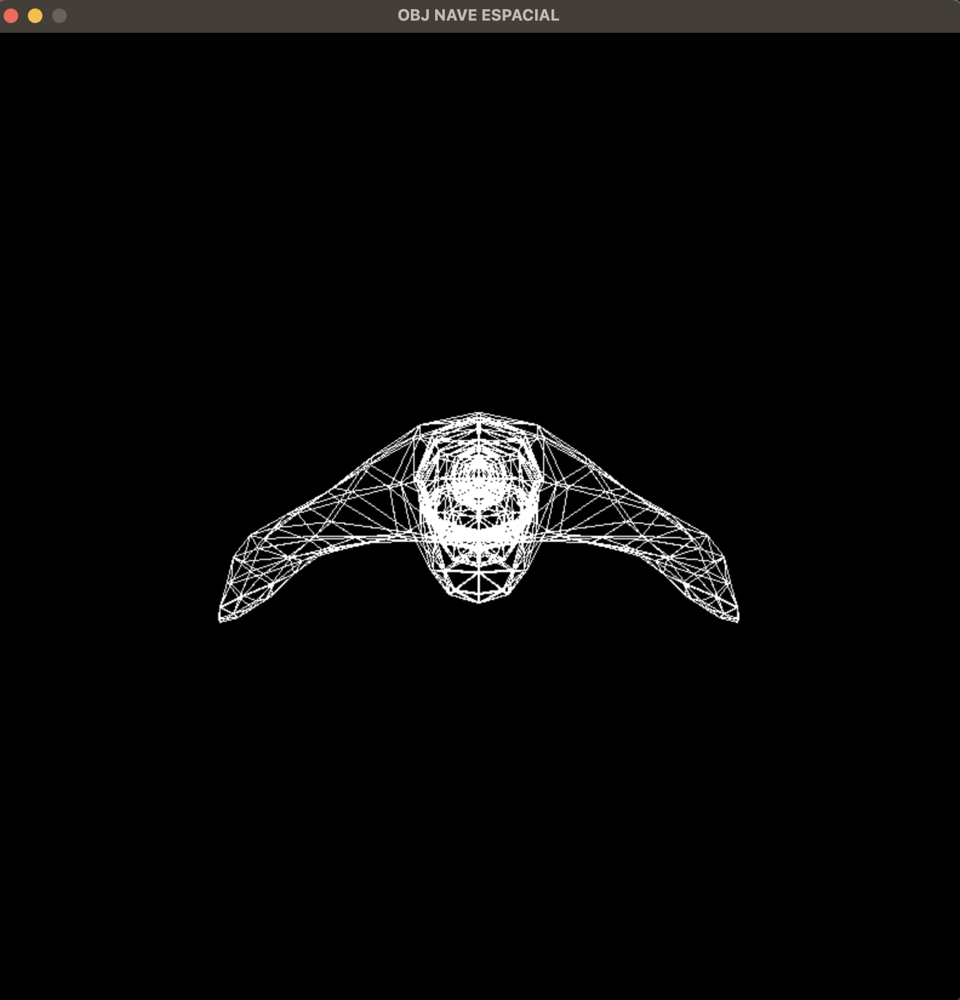

# Proyecto01-CC2018
Proyecto 01, Gráficas por computadora.

## ¿Cómo ejecutarlo?
### Para usuarios de MacOS
El código ya tiene implementado un _shortcut_ por lo que solo debes ejecutar el siguiente comando:
```
./run.sh
```

### Para usuarios de Windows
Ejecuta los comandos en el siguiente orden
```
cmake -G "Unix Makefiles" -S . -B build
cd build && make
call PROJECT.exe
```

## SR1: Carga de modelos
Carga de modelo realizado en blender y exportado en un archivo obj. Programa que renderiza por medio de vértices de triángulos para la creación del esqueleto del diseño.

### Resultado:
